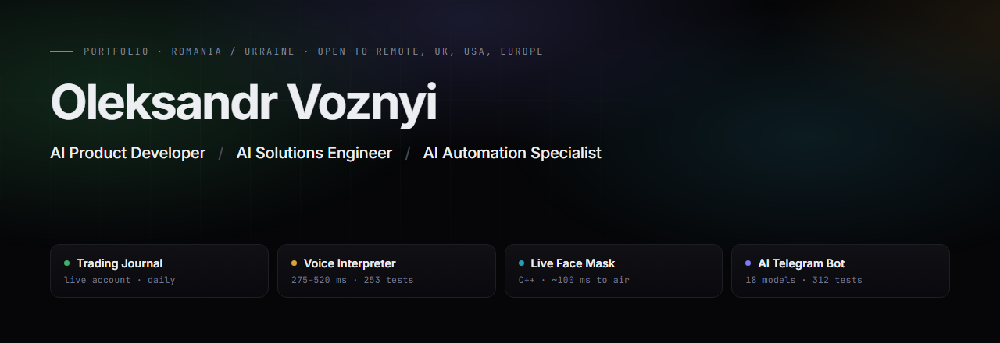
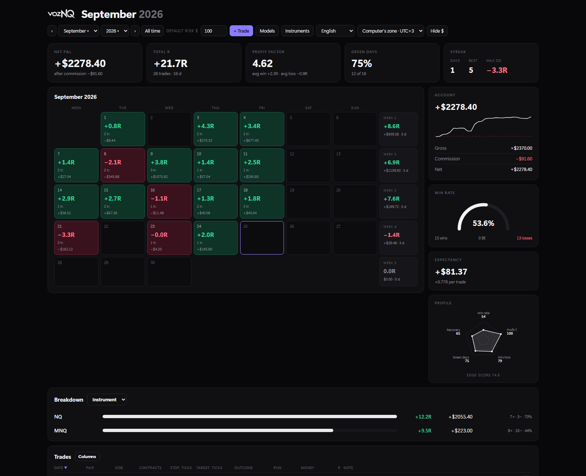
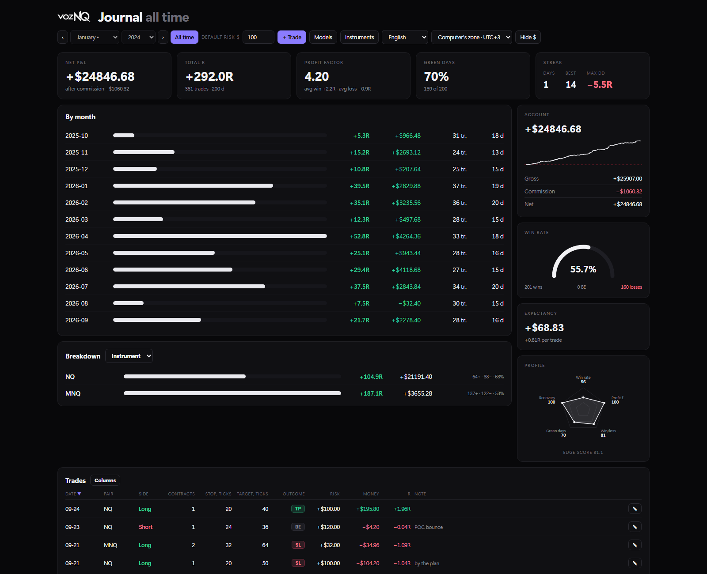

### [▶ Open the live portfolio — films play right on the page](https://ovallprojects.github.io/portfolio/)

**English** · [Русская версия](README.ru.md)

---

Four products so far. One runs on a **live trading account** every day, one has **paying
subscribers**, one puts a replaced face on a live stream in **~100 ms**, and one translates a
conversation faster than the other person can finish a sentence.

Every clip and screenshot here comes from the running application. Nothing is a mockup.
Four products in production today, **with more in development** — see [what comes
next](#what-comes-next).

| | |
|---|---|
| **4** | products running, not prototypes |
| **565** | automated tests across two of them |
| **18** | AI models behind one chat window |
| **275 ms** | fastest measured speech-to-speech |

---

## 01 · Trading Journal

**A futures journal that survives changing the instrument.**
*In daily use on a live account.*

Every trade is stored as a distance in ticks, not as a number of dollars. Switch the contract or
the size and the money, the R-multiples and the whole statistic recalculate themselves — instead
of quietly becoming wrong, the way a spreadsheet does.

https://github.com/user-attachments/assets/c8c2c66f-0786-4095-a8b1-83f5dfdb9a3f

- One file — `TradeJournal.exe` at 13.6 MB. No Python, no installer, no runtime to chase
- 16 futures contracts preloaded with tick value and per-contract commission
- Nothing leaves the machine: `trades.db` sits next to the app, a backup is a file copy
- Interface in English and Russian, session-aware time zones

`Python · stdlib only`  `SQLite`  `WebView2`  `single-file build`

**[▶ Watch the full walkthrough](https://ovallprojects.github.io/portfolio/#journal)** · [Every control, explained →](projects/trade-journal.md)

 

---

## 02 · AI Voice Interpreter

**Two people, two languages, one conversation.**
*Core done · 253 tests.*

You speak Russian and the other person hears English in a generated voice, both directions,
while the call keeps going. Recognition, translation and speech all run on the machine — the
conversation never leaves the room.

https://github.com/user-attachments/assets/a628b758-9aeb-4a88-9a93-1e32801685a7

- **275–520 ms** from the end of a phrase to the first translated sound — measured, not estimated
- Streaming mode starts translating before the speaker has finished
- Translation-quality layer: **70% → 97%** accuracy on a held-out set
- Appears as an ordinary microphone inside Zoom, Discord and Meet
- No cloud, no account, no per-minute bill

`Python`  `Whisper large-v3-turbo`  `Argos MT`  `Piper · Kokoro TTS`  `CUDA`

**[▶ Watch the full walkthrough](https://ovallprojects.github.io/portfolio/#interpreter)** · [Latency, quality and what is not done →](projects/ai-voice-interpreter.md)

 

---

## 03 · Live Face Mask

**Five neural networks per frame, inside 33 milliseconds.**
*Working · ~100 ms camera to stream.*

Detection, 106 landmarks, identity embedding, generation and face parsing run on every single
frame of the webcam feed, and the result goes straight into OBS as a clean window. No plugin, no
virtual camera driver, nothing to install into OBS.

https://github.com/user-attachments/assets/9ea8aea5-e187-4448-9d36-d2464d272b23

- **~100 ms** camera to air — three frames at 30 fps, short enough that lips stay with the sound
- 5 ONNX models, about 770 MB, resident on the GPU
- Written in **C++17** with GPU inference — not a Python wrapper
- Per-stage latency shown live, so a slow frame has a name

> **The watermark is not a setting.** "AI-generated face effect" is burned into every output
> frame and cannot be switched off. A face swap that hides what it is would be a different tool
> for a different purpose, and I did not want to build that one.

`C++17 · CMake`  `ONNX Runtime`  `CUDA · cuDNN`  `Direct3D 11`  `Dear ImGui`  `Media Foundation`

**[▶ Watch the full walkthrough](https://ovallprojects.github.io/portfolio/#face)** · [The pipeline, the sliders, the limits →](projects/live-face-mask.md)

---

## 04 · AI Telegram Bot

**One chat window, eighteen models behind it.**
*In production · paying users.*

You do not pick a specialisation and you do not learn commands. Send a photo, a voice message, a
spreadsheet or a link, and the right model gets the job — including when the subject changes
mid-conversation and back again.

- **18 models**, chosen automatically per question; user ratings feed back into that choice
- Produces real `.pptx` decks and `.docx` papers in 11 regional formatting standards
- Builds trading indicators for 7 platforms, compiling `.jar` studies server-side
- **312 tests**, one suite dedicated purely to pricing mistakes that cost money
- Official provider APIs only — no cookies, no session tokens, nothing bannable

`Python · aiogram`  `PostgreSQL · Alembic`  `Docker Compose`

[Every capability and layer →](projects/ai-telegram-bot.md)

---

## Why there is no source code here

These are products, not exercises. Two of them earn money, one handles a live trading account,
and each took months to build. This repository shows **what exists and that it works**; the code
stays private.

Happy to walk through any part of it in a call, demo it live, or share a specific module on
request.

## How these were built

I define the product, decide how it must behave, test every build against real use, and write the
implementation together with an AI coding tool. The requirements, the architecture decisions, the
acceptance and the bug hunting are mine; a large share of the typing is not. It is a fast way to
build, and I would rather say so plainly than let anyone assume otherwise.

What that leaves me good at: turning a vague idea into a precise specification, finding the case
where the thing breaks, and shipping something a real person uses the next morning.

Three habits visible in all four projects:

- **Nothing pretends to work.** Unavailable features are shown disabled with the reason next to
  them — there are no buttons that look alive and do nothing.
- **Honest numbers.** Latency is measured, not estimated; the translation quality figure quoted
  is the one from the held-out set, not the set the rules were tuned on.
- **The failure is named.** When the camera hands over the wrong pixel format, the app says so
  instead of leaving you with a low frame rate and no explanation.

---

## What comes next

Four products in production. The list keeps growing.

- **Complete, not in progress.** All four are built, tested and in real use — one on a live
  trading account every trading day, one with paying subscribers. None of them is a prototype
  waiting on a final feature.
- **Further products in development.** More are being built now. They are added here on the
  same terms as these four: running, measured, and shown from the real application.
- **Development continues after release.** Products that are used keep growing. The journal
  gains a new breakdown when a month of trading calls for one; the bot gains models as
  providers release them.
- **What qualifies for this page.** A project is listed only once it is in real use by
  someone. That is why there are four rather than fourteen, and why the number will rise
  slowly.

*Last updated: 25 September 2026. The commit history shows how often this repository changes.*

---

## Contact

**Oleksandr Voznyi** · Romania / Ukraine · open to remote, UK, USA, Europe

- Email — [aleksandr.vzn@icloud.com](mailto:aleksandr.vzn@icloud.com)
- Telegram — [@s1804v](https://t.me/s1804v)
- LinkedIn — [oleksandr-voznyi](https://www.linkedin.com/in/oleksandr-voznyi-763a41439/)
- GitHub — [OVALLProjects](https://github.com/OVALLProjects)

A call works in English or Russian. If you want to see something specific — the tick maths, the
latency breakdown, the tariff tests — say which, and I will open that part on screen.
