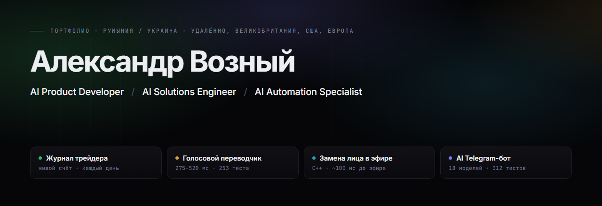
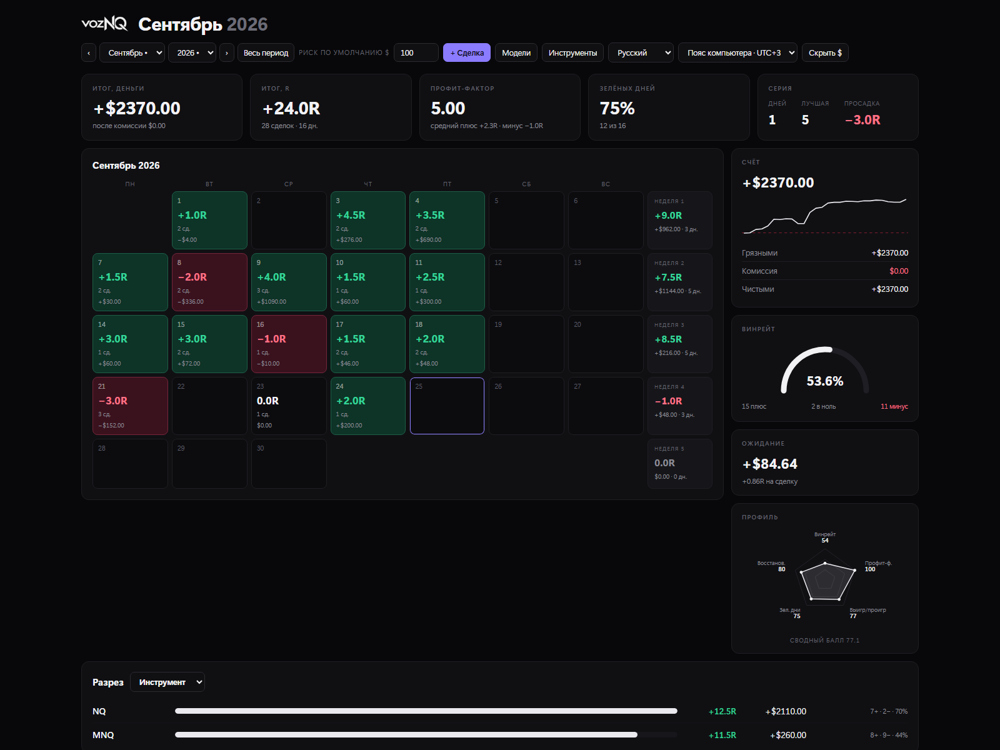
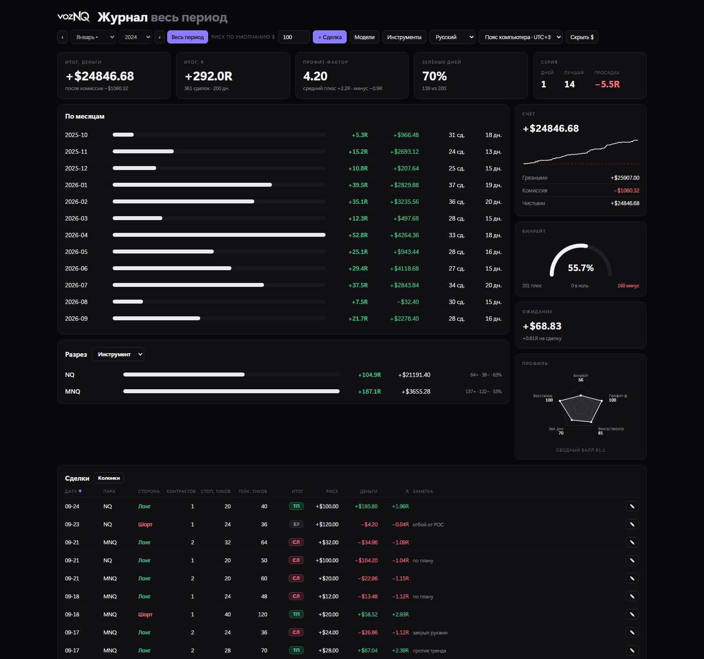

### [▶ Открыть портфолио — ролики играют прямо на странице](https://ovallprojects.github.io/portfolio/ru.html)

[English](README.md) · **Русский**

---

# Четыре продукта. Три недели. Один человек.

Около года учёбы, за который я не выпустил ничего. Потом сентябрь 2026-го: настольный журнал
трейдера, голосовой переводчик в реальном времени, конвейер замены лица на C++ и видеокарте,
Telegram-помощник с **18 моделями** за одним окном чата. Четыре технические области, и ни в одной
из них я до этого не работал.

Этот темп я и предлагаю. Беру объём и несколько задач сразу, быстро вхожу в незнакомую область и
довожу продукт от размытого требования до вещи, которую человек открывает и пользуется. Все
четыре готовы и работают — каждый ролик и каждый скриншот здесь сняты с работающего приложения.

| | |
|---|---|
| **565** | автотестов, написанных в двух из них |
| **275 мс** | замеренный перевод голоса, целиком на этой машине |
| **~100 мс** | от камеры до эфира, пять сетей на кадр |
| **13,6 МБ** | весь журнал: один файл, ничего не устанавливается |

---

## Что я приношу

**Четыре технические области. Ни одна не была мне знакома.** Настольное приложение, конвейер
реального времени на видеокарте, локальный речевой ИИ и сервис поверх восемнадцати провайдеров не
делят ни строчки кода и почти не делят словарь. До этого года я не писал на C++, не трогал CUDA и
не работал с речевыми моделями. Переносится между ними то, как продукт решается, строится и
проверяется, — и именно эта часть переходит на то, что строите вы.

- **Область я осваиваю тем, что выпускаю в ней продукт.** В каждую из этих четырёх я вошёл,
  доведя в ней вещь до конца, а не прочитав о ней сначала. Тридцать три миллисекунды на кадр
  учат конвейерам на видеокарте за неделю больше, чем курс за семестр: срок настоящий, и оно
  либо идёт тридцать кадров в секунду, либо нет. Дайте предметную область, которой я никогда не
  касался, — ответ будет той же формы: спецификация за дни, открываемая вещь за недели.
- **Мне нужен объём.** Четыре продукта за три недели — тот темп, в котором мне нравится
  работать и который я хочу держать дальше: несколько задач в работе одновременно, решения
  принимаются быстро и пересматриваются, когда так говорит замер. Предпочитаю отвечать за
  результат целиком — что вещь обязана делать, как она устроена, годится ли она к релизу, — а не
  проходить очередь задач, нарезанную кем-то другим.
- **Всё начинается со спецификации.** Что вещь обязана делать, у кого она в руках и что сделает
  её бесполезной — записано до того, как появилась архитектура. Споры, которые иначе приходят на
  шестой неделе, проходят на первой странице, пока передумать ничего не стоит. Дальше архитектура
  отвечает одному ограничению: 33 мс на кадр, трейдер, который не станет ставить среду
  исполнения, стример, у которого нет лишнего монитора. Я нахожу то, которое действительно
  держит, и строю от него.
- **Цифры берутся из замера.** Задержка разложена по стадиям и показана прямо во время работы.
  Точность снята с материала, которого правила не видели, — поэтому у переводчика стоит 97%, а
  не цифра повыше с собственного настроечного набора. Любая цифра, которую я не могу
  воспроизвести по требованию, не попадает ни в этот репозиторий, ни в разговор.
- **Реализация пишется с ИИ-инструментом разработки.** Я ставлю требования, решаю, как продукт
  себя ведёт, принимаю архитектурные решения и проверяю каждую сборку на реальной работе; код
  пишется вместе с ИИ-помощником. Именно поэтому один человек закрывает четыре технические
  области в таком темпе — и ровно тот же рычаг я приношу в команду.

**Что здесь есть, а чего нет.** Репозитории остаются закрытыми: здесь доказательство, а не
исходники. Готов разобрать любую часть кода на созвоне, запустить что угодно из этого вживую при
вас или отдать отдельный модуль.

---

## Навыки

| | |
|---|---|
| **Языки и платформы** | Python · asyncio · C++17 · CMake · SQL · HTML/CSS/JS · PowerShell · Git · REST API · Windows desktop · Linux · Docker |
| **ИИ внутри работающего продукта** | 18 LLM-провайдеров · маршрутизация по намерению · prompt engineering · Whisper large-v3-turbo · ONNX Runtime · CUDA · cuDNN · Piper · Kokoro TTS · Argos MT · слои качества над выходом модели |
| **Системы и поставка** | PostgreSQL · Alembic · SQLite · aiogram · Docker Compose · слоистая архитектура · Direct3D 11 · Media Foundation · WebView2 · сборка в один файл |
| **Продуктовая работа** | Спецификация · архитектура под одно ограничение · замер задержки · автотесты · юнит-экономика · интерфейсы EN/RU/UA · релиз и приёмка |

---

## 01 · Журнал трейдера

**Журнал по фьючерсам, который переживает смену инструмента.**
*Каждый день в работе на живом счёте.*

Настольный журнал для фьючерсной торговли: внести сделку, перечитать месяц, понять, какая модель
входа действительно себя окупает. Шесть аналитических разрезов над одной базой.

https://github.com/user-attachments/assets/c8c2c66f-0786-4095-a8b1-83f5dfdb9a3f

**Решение — хранить расстояние, а не деньги.** Сделка записывается расстоянием в тиках и
инструментом, на котором она была взята; доллары, R-кратности и вся статистика выводятся уже при
чтении — из стоимости тика и комиссии этого инструмента. *Что это дало:* сменили контракт или
объём позиции — и вся история пересчиталась сама. Таблица в этом месте продолжает показывать
старые цифры и никак об этом не сообщает.

- Один файл — `TradeJournal.exe` на 13,6 МБ. Интерфейс — HTML, который рисует встроенный в Windows
  WebView2, под ним стандартная библиотека Python и SQLite: ни фреймворка, ни стороннего пакета,
  ни установщика, и через год нечему ломаться в зависимостях
- 16 фьючерсных контрактов уже заведены со стоимостью тика и комиссией по каждому
- Ничего не уходит с машины: `trades.db` лежит рядом с программой, бэкап — это копия файла
- Интерфейс на русском и английском, часовые пояса по торговым сессиям

`Python · только stdlib`  `SQLite`  `WebView2`  `сборка в один файл`

**[▶ Посмотреть полный обзор](https://ovallprojects.github.io/portfolio/ru.html#journal)** · [Каждый элемент, по порядку →](projects/trade-journal.ru.md)

 

---

## 02 · Голосовой переводчик

**Два человека, два языка, один разговор.**
*Работает · 253 теста.*

Вы говорите по-русски, собеседник слышит английский синтезированным голосом — и в обратную
сторону тоже, пока разговор идёт. Распознавание, перевод и речь считаются на самой машине:
разговор не покидает комнату.

https://github.com/user-attachments/assets/a628b758-9aeb-4a88-9a93-1e32801685a7

**Решение — никогда не ждать тишины.** Звук режется на фразы прямо по ходу речи, а не после
паузы, и готовый кусок уходит в распознавание, пока следующий ещё произносится. *Что это дало:*
замеренные **275–520 мс** от конца фразы до первого переведённого звука — в работе остаётся
только хвост. Система, которая дожидается конца высказывания, платит за него целиком.

- Слой качества над машинным переводом — словарь терминов, которые не должны плыть, правки для
  конструкций, которые модель ломает стабильно, проверка, что на выходе вообще получилось
  предложение: **70% → 97%** на отложенном наборе, под который правила не писались
- Push-to-talk, отключение микрофона и защита от эха — чтобы это держалось в живом разговоре
- Виден как обычный микрофон внутри Zoom, Discord и Meet
- Ни облака, ни аккаунта, ни поминутного счёта
- 253 автоматических теста

`Python`  `Whisper large-v3-turbo`  `Argos MT`  `Piper · Kokoro TTS`  `CUDA`

**[▶ Посмотреть полный обзор](https://ovallprojects.github.io/portfolio/ru.html#interpreter)** · [Задержка, качество и чего ещё нет →](projects/ai-voice-interpreter.ru.md)

 

---

## 03 · Замена лица в эфире

**Пять нейросетей на кадр, и всё это внутри 33 миллисекунд.**
*Работает · ~100 мс от камеры до эфира.*

Подменяет лицо в живом потоке с камеры прямо во время съёмки и отдаёт готовую картинку в OBS
обычным окном — ни плагина, ни драйвера виртуальной камеры, ставить в OBS ничего не нужно.
Детектор, 106 точек лица, вектор личности, генерация и разбор лица на области проходят на каждом
кадре.

https://github.com/user-attachments/assets/9ea8aea5-e187-4448-9d36-d2464d272b23

**Решение — C++ и кадр, который не покидает видеокарту.** Тридцать кадров в секунду оставляют
33 мс на все пять сетей, и Python отпал сразу. Приложение написано на C++17 с ONNX Runtime на
CUDA, кадр остаётся в видеопамяти от захвата до сборки итоговой картинки — между стадиями его не
копируют обратно в оперативную, — и каждая стадия показывает свои миллисекунды на экране.
*Что это дало:* **~100 мс** от камеры до эфира, три кадра при 30 fps, и медленный кадр, у
которого есть имя, а не пожатие плечами.

- Вписывается по карте разбора лица, посчитанной на этом же кадре, а не по эллипсу: волосы, очки и
  рука перед щекой остаются на месте, а настоящий рот можно оставить — попадание в губы остаётся
  точным, и это та деталь, по которой подмену замечают раньше всего
- 5 ONNX-моделей, около 770 МБ, постоянно лежат в памяти видеокарты
- Задержка по стадиям видна на ходу: сеть, генератор, точки, маска, сборка кадра

> **Отметка вжигается в картинку.** Подпись «AI-generated face effect» ставится последней,
> поверх всего, и выключателя у неё нет. Площадки срезают метаданные, поэтому строка, записанная
> в пиксели, — единственная, которая переживает перекодирование, скачивание и повторную заливку.

`C++17 · CMake`  `ONNX Runtime`  `CUDA · cuDNN`  `Direct3D 11`  `Dear ImGui`  `Media Foundation`

**[▶ Посмотреть полный обзор](https://ovallprojects.github.io/portfolio/ru.html#face)** · [Конвейер, ползунки и границы →](projects/live-face-mask.ru.md)

---

## 04 · AI Telegram-бот

**Одно окно чата, восемнадцать моделей за ним.**
*Работает в Telegram.*

Пришлите фото, голосовое, таблицу или просто ссылку — ответит та из моделей, которая подходит под
этот вопрос, в том числе когда тема посреди разговора ушла в сторону и вернулась обратно. Ни
режима выбирать, ни команд учить.

**Решение — модель выбирает маршрутизатор, а не человек.** Каждое сообщение сначала читается на
намерение: что за задача, нужно ли зрение, длинный контекст или код, — и из этого получается и
тема вопроса, и порядок моделей, к которым идти; оценки, которые пользователи ставят ответам,
меняют, кто победит в следующий раз. *Что это дало:* никому не нужно знать, какая из восемнадцати
моделей в чём хороша, а девятнадцатую можно добавить, не меняя ни одной привычки пользователя.

**Решение — официальные API и отказ от короткого пути.** Потребительские подписки на ИИ можно
перепродавать, гоняя их через перехваченные сессии браузера, — так сделана изрядная часть таких
ботов. Этот работает на платных API провайдеров. *Что это дало:* сервис, который продолжает
работать на той неделе, когда провайдер закручивает гайки, а не исчезает вместе с аккаунтом, на
котором ехал.

- Четыре слоя — Telegram, бизнес-логика, провайдеры, хранилище: новая модель правится в одном
  месте, новый язык интерфейса в другом, у арифметики тарифов свой набор тестов. Восемнадцать
  провайдеров, накопленные со временем, не превратили код в клубок
- Платформа без ключа вообще не появляется в меню, а не появляется и ломается при нажатии
- Делает настоящие презентации `.pptx` и работы `.docx` в 11 региональных стандартах оформления
- Собирает торговые индикаторы для 7 платформ, компилируя `.jar`-скрипты на сервере
- **312 тестов**, и один набор занят только ошибками в тарифах, которые стоят денег
- Голосовые уходят в модель звуком, без промежуточной расшифровки

`Python · aiogram`  `PostgreSQL · Alembic`  `Docker Compose`

[Все возможности и слои →](projects/ai-telegram-bot.ru.md)

---

## Что дальше

Продукт попадает на эту страницу после того, как он закончен и работает, — поэтому она
наполняется медленно и ничего на ней не является анонсом. Все четыре развиваются и после релиза:
журнал получает новый разрез, когда этого требует очередной месяц торговли, бот получает модели
по мере их выхода у провайдеров, маска переезжает с захвата окна на полноценную виртуальную
камеру. Ещё несколько строятся прямо сейчас и попадут сюда на тех же условиях — законченными,
измеренными, работающими.

**Что я ищу.** Роль, где всё это пойдёт в продукт компании: ИИ-функции, агенты, голос,
автоматизация. Удалённо, полная занятость или контракт, Великобритания, США или Европа. Если стек
мне незнаком — здесь это обычный случай, а не исключение.

*Обновлено 25 сентября 2026. По истории коммитов видно, как часто меняется репозиторий.*

---

## Связь

**Александр Возный** · Румыния / Украина · удалённо, Великобритания, США, Европа

- Почта — [aleksandr.vzn@icloud.com](mailto:aleksandr.vzn@icloud.com)
- Telegram — [@s1804v](https://t.me/s1804v)
- LinkedIn — [oleksandr-voznyi](https://www.linkedin.com/in/oleksandr-voznyi-763a41439/)
- GitHub — [OVALLProjects](https://github.com/OVALLProjects)

Созвон на русском или английском. Если хотите увидеть что-то конкретное — математику тиков,
разбор задержки, тесты тарифов — скажите, что именно, и я открою эту часть на экране.
