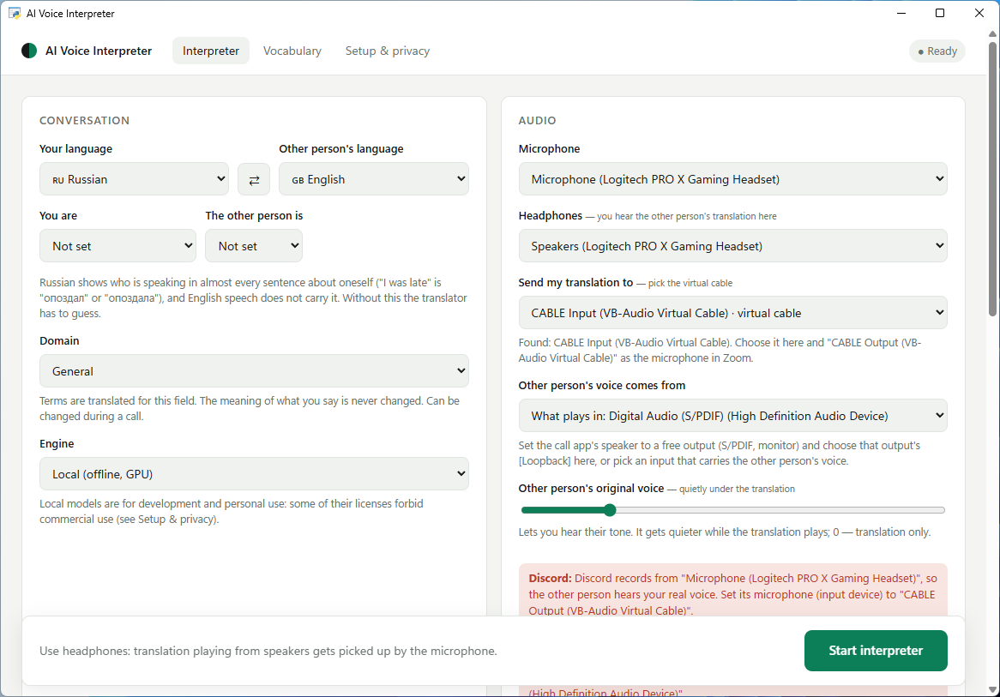
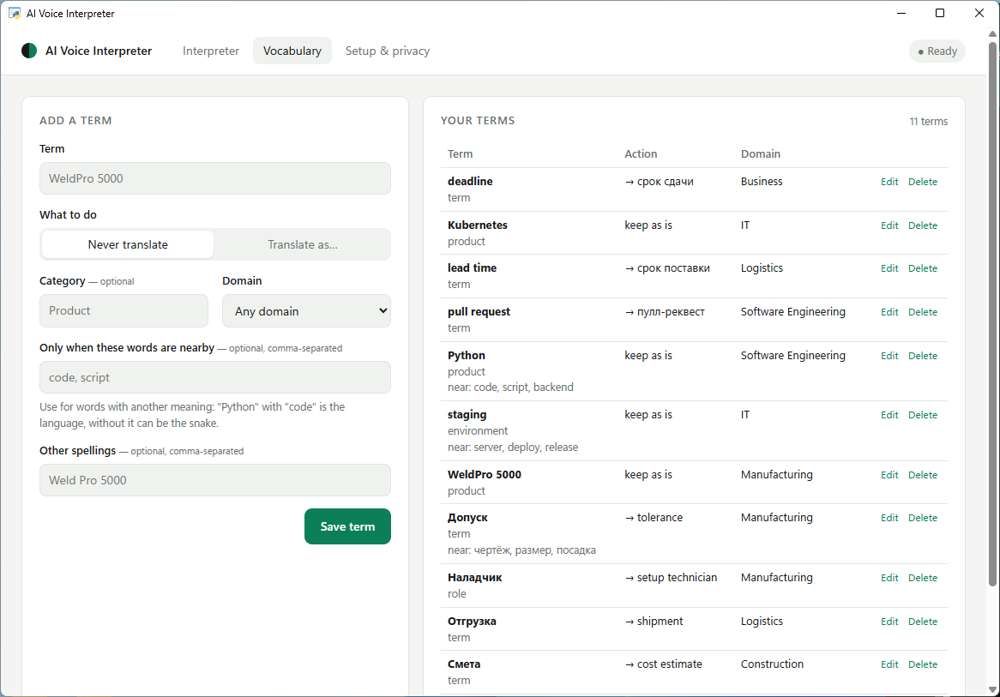
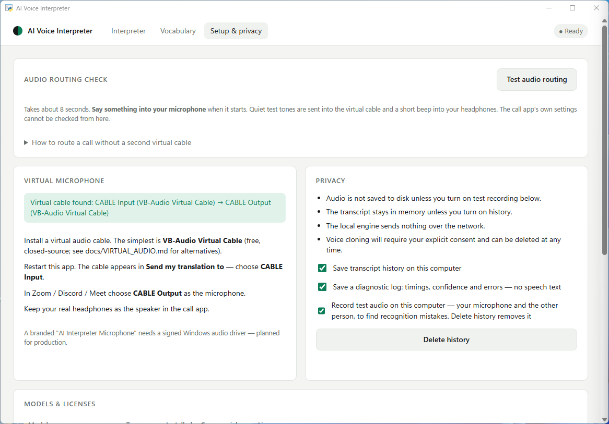

# Голосовой переводчик

Двое разговаривают, каждый на своём языке. Вы говорите по-русски — собеседник слышит
английский; он отвечает по-английски — вы слышите русский. В Windows программа выглядит как
обычное аудиоустройство, поэтому работает внутри Zoom, Discord, Google Meet — везде, где
можно выбрать микрофон.

> [English version](ai-voice-interpreter.md) · [← к портфолио](../README.ru.md)

[▶ ролик на 30 секунд](../media/video/voice-interpreter.mp4)

---

## В чём сложность

Переводом речи никого не удивишь. Трудность не в переводе, а в **задержке** и в том, что
перевод делает со словами, которые менять нельзя.

**Задержка.** Замерено на RTX 5060 Ti, модели прогреты:

| Шаг | Время |
|---|---|
| Распознавание фразы 3–5 с (Whisper large-v3-turbo) | 160–300 мс |
| Перевод (Argos) | 40–100 мс |
| Слой качества | ~1 мс |
| Синтез до первого звука | 55–135 мс |
| **Конец вашей фразы → первый звук перевода** | **275–520 мс**, в демо-разговоре в среднем 413 мс |

Детектор речи ждёт ещё 350 мс тишины, прежде чем решить, что фраза закончилась. В потоковом
режиме перевод начинается, не дожидаясь конца: на реплике в 9 секунд первый звук приходит
через 3,6 с вместо 9,6 с.

**Что нельзя менять.** Обычный переводчик превращает «Python» в змею, «Apple» в яблоко,
коверкает номера версий и теряет отрицание. Отдельный слой защищает термины, названия, код,
числа, даты и адреса, решает «змея или язык» по смыслу разговора, разбирает идиомы и сленг,
чинит то, что не расслышало распознавание («си плюс плюс» → C++), и потом сверяет результат
с оригиналом по числам, отрицаниям и форме вопроса. Не сошлось — фраза помечается *низкой
уверенностью*, а не выдаётся как ни в чём не бывало.

Замерено на **отложенном наборе из 30 фраз, на котором правила не настраивались: 70% →
97%**. На основном наборе из 105 фраз — 59% → 100%, но именно под него правила и писались,
поэтому честная цифра — отложенная.

---

## Окно

*(Снято на запущенном приложении — устройства в списках те, что оно само нашло.)*

**Разговор** — ваш язык и язык собеседника, между ними кнопка обмена. **Вы / Собеседник** —
род: русский язык отмечает пол говорящего почти в каждой фразе о себе («опоздал» или
«опоздала»), а в английском этого нет, и без подсказки переводчику остаётся гадать.
**Сфера** — область, чьи термины защищаются; их 17, включая режим собеседования, и менять её
можно прямо во время звонка.

**Звук** — микрофон, наушники, в какой виртуальный кабель уходит перевод и откуда берётся
голос собеседника. **Оригинальный голос** — ползунок: интонацию собеседника слышно тихо под
переводом, и она приглушается, пока перевод говорит. На нуле остаётся только перевод.

**Голос и поведение** — голос и скорость, живые голоса для каждого языка (человечнее, но
начинают на 0,3–0,5 с позже) и ползунок задержки от *ответить быстрее* до *дождаться конца
фразы*. Дальше переключатели, которые и решают, каково это в живом разговоре: переводить по
ходу речи, переводить входящий голос, обрывать перевод, когда кто-то заговорил (для колонок;
с наушниками не нужно), показывать расшифровку, говорить по удержанию пробела, защита от
эха, автоопределение языка.

**Запустить** — единственная кнопка, которая нужна. Всё недоступное показано **выключенным с
причиной рядом**: кнопок, которые выглядят рабочими и ничего не делают, здесь нет.

---

## Маршруты звука — обычно именно на них всё и разваливается

- Перевод уходит в **виртуальный кабель** и выбирается в Zoom как микрофон. Проверено на
  живом VB-Cable: перевод, записанный с CABLE Output, распознан заново на 96% слов.
- Голос собеседника можно взять **без всякого драйвера**: вывести звук звонка на свободный
  выход и захватить его через loopback. Проверено на устройстве.
- Маршруты проверяются на петли до звонка, и есть самопроверка, которая говорит, какой
  маршрут неверен, вместо того чтобы оставить вас в тишине.

---

## Словарь — слова, которые переводчику нельзя придумывать

Термин либо **остаётся как есть** — названия продуктов, инструментов, всё, что переводить
незачем, — либо **переводится одним заданным способом**, чтобы одно и то же слово не вышло
посреди звонка по-разному. У записи можно задать сферу, склонения и условие «только если
рядом эти слова»: *Python* рядом с *code* или *script* — язык, во всех остальных случаях —
змея. Импорт и экспорт — JSON и CSV, так что глоссарий можно подготовить вне приложения.

*(Термины на снимке придуманы для скриншота.)*

---

## Настройка и приватность

**Проверка маршрутов звука** занимает около восьми секунд: в виртуальный кабель уходят
тестовые тоны, в наушники — короткий сигнал, и приложение говорит, какое именно плечо
маршрута настроено не так, вместо того чтобы оставить вас в тишине во время звонка.

Приватность — набор переключателей, и все выключены, пока их не включат: звук на диск не
пишется, расшифровка остаётся в памяти, локальный движок ничего не отправляет в сеть, а
клонирование голоса требует явного согласия, а сохранённый голос можно удалить. **Удалить
историю** стирает всё разом.

---

## Что ещё внутри

Память разговора и профиль говорящего — только в оперативной памяти, на диск не пишутся ·
стили Natural / Literal локально · учёт минут и символов с тарифами Free / Pro / Business ·
панель разработчика с задержками по этапам, метриками качества и разбором фразы.

Приватность: весь путь — распознавание, перевод, синтез — работает локально на машине.
Облачные модели необязательны и по умолчанию выключены.

---

## Честное состояние

Работает и проверено: оба направления, потоковый режим, слой качества, маршруты звука, окно,
прерывание, защита от эха, mute, push-to-talk. **253 теста.**

Не сделано: облачные движки речь-в-речь, разделение говорящих и перекрёстная речь,
шумоподавление и эхоподавление (качество звука пока только измеряется), подстройка под свой
голос. Настоящий звонок с живым собеседником ещё впереди — всё проверенное до сих пор
проверялось записями и loopback.

| | |
|---|---|
| Язык | Python 3.12, Windows 10/11 |
| Распознавание | Whisper large-v3-turbo |
| Перевод | Argos (локально), опционально LLM для переписывания в стиле |
| Речь | Piper, Kokoro, Vosk |
| Ускорение | CUDA; на процессоре примерно в 14 раз медленнее |
| Интерфейс | pywebview, одна HTML-страница |
| Поставка | переносимая сборка, запускается без установленного Python |
