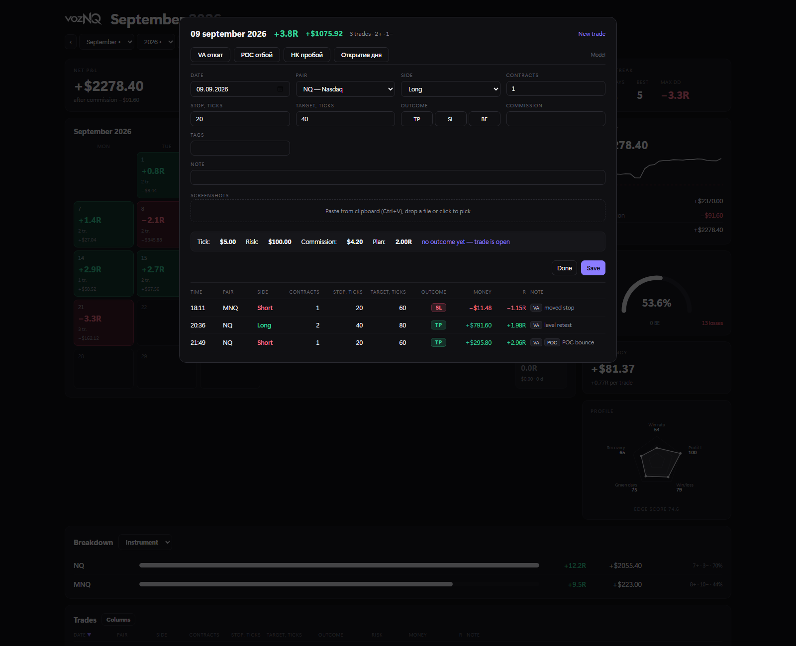
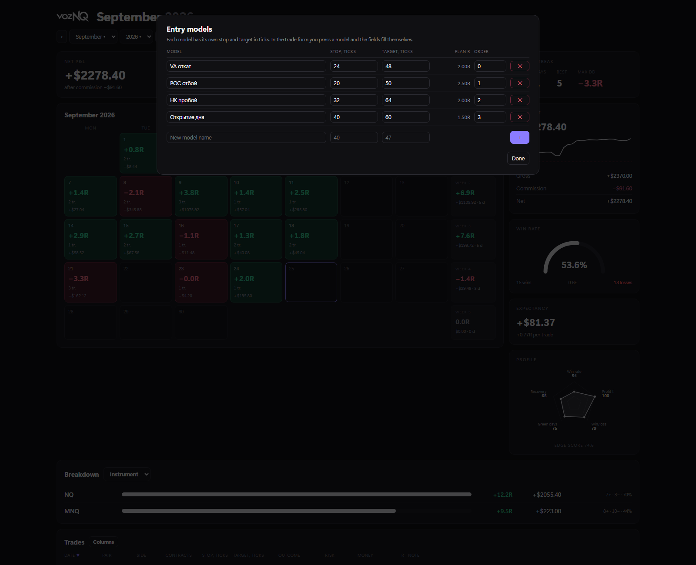
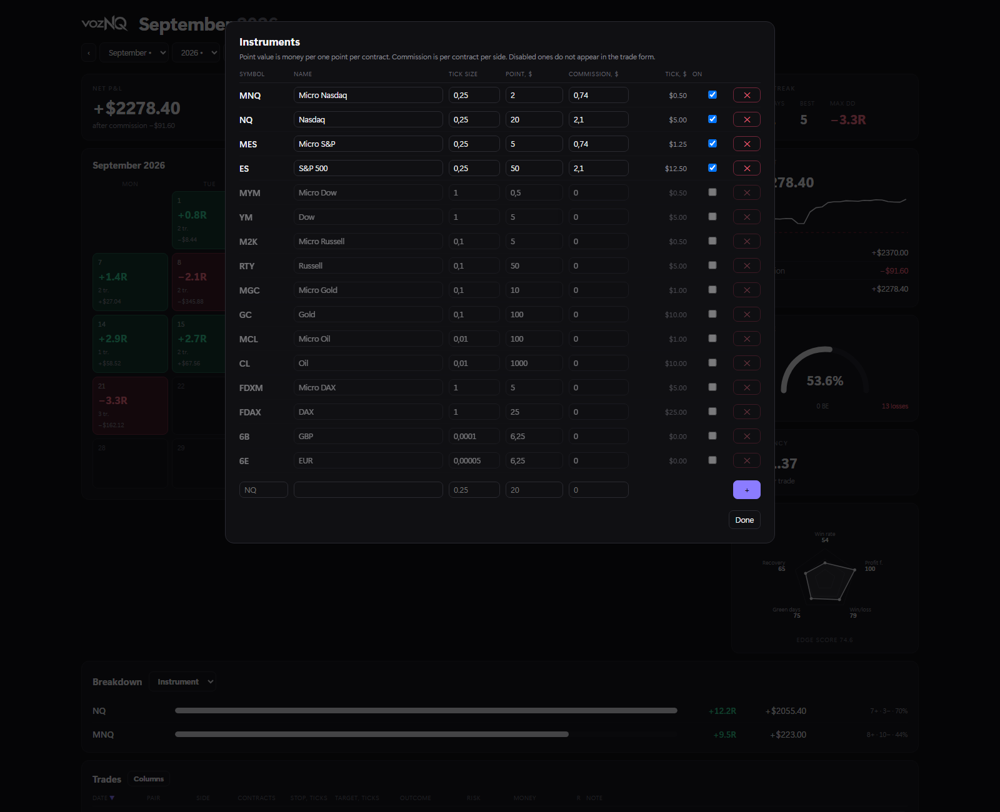
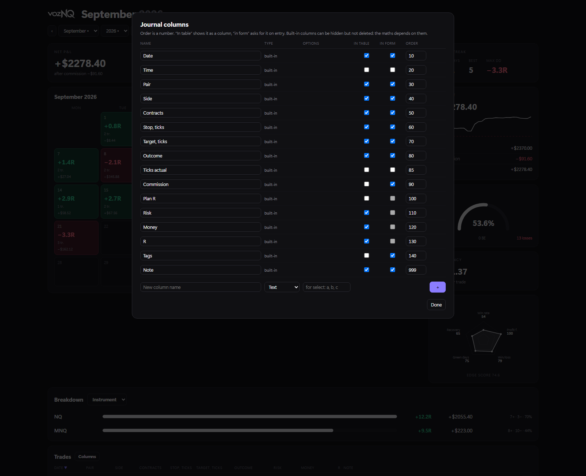

# Trading Journal

A desktop journal for futures traders. One `.exe`, no installer, no account, no cloud: the
journal file lives next to the program, and nothing leaves the machine.

> [Русская версия](trade-journal.ru.md) · [← back to portfolio](../README.md)
>
> **The numbers in every screenshot are generated demo data**, not real trades — the real
> journal holds a live account.

[▶ 30-second clip](../media/video/trade-journal.mp4)

---

## The problem it solves

Broker statements count money. A trader has to count **risk**: the same +$200 is a good day
on one contract and a bad one on four. So every trade here is entered as a distance in
**ticks** — stop 24 ticks, target 48 — and the app turns that into money, into R (multiples
of the risk taken) and into statistics. Change the instrument or the position size and the
history does not lie to you.

---

## The month screen

**The top row is the whole control panel.**

| Control | What it does | Why it helps |
|---|---|---|
| `‹` `September` `2026` `›` | moves through months | arrows for stepping, the two lists for jumping straight to a month a year back |
| **All time** | switches the calendar to a month-by-month table of the entire history | one click between "how is this month going" and "how is this year going" |
| **Default risk $** | the money behind 1R | change it once and every R in the journal is recalculated — no re-entering trades after raising position size |
| **+ Trade** | opens the entry form | |
| **Models** | entry setups: preset stop and target | |
| **Instruments** | tick value, point value, commission per contract | |
| language | Russian / English, switches instantly | |
| time zone | which day a late-evening trade belongs to | a US session trade at 01:30 local time is still the previous trading day |
| **Hide $** | hides money, leaves R | so the screen can be shown to someone without showing the account size |

**The five cards** are the only numbers that matter at a glance: net P&L after commission,
total R, profit factor with the average win and average loss behind it, the share of green
days, and the streak — current, best, and the deepest drawdown.

**The calendar** puts each day's R, number of trades and money in its own cell, green or red,
and closes every row with a weekly total. Patterns show up without any analysis: Mondays that
are always red, or a bad week that a good month hides.

**The right column**: the account curve with the starting line marked, gross → commission →
net (commission is what quietly eats a scalper), the win rate arc with wins / breakeven /
losses, expectancy per trade in both money and R, and a profile radar — win rate, profit
factor, win/loss size, green days, recovery — with a single edge score under it.

**Breakdown** at the bottom splits the result by instrument, by model or by tag.

Every day cell is a link (`#day=2026-09-09`), so a particular day can be bookmarked or sent
to someone.

---

## All time

The same statistics over the full history, with a month-by-month table: R, money, number of
trades and how many days were traded. The trades table below takes the whole period, with
outcome badges (TP / SL / BE), risk, money, R and the note left at the time.

---

## A day

Everything for one day in one window: the trades already entered, and the form for the next
one.

- **Model buttons** at the top fill stop, target, instrument and size in one click.
- **Outcome** is TP / SL / BE, or a tick count typed by hand when the exit was manual.
- **The calculation strip** updates as you type: tick value, risk in money, commission, and
  the planned R of the trade. You see what you are risking *before* the trade is saved.
- **Ctrl+Enter** saves without reaching for the mouse.
- Screenshots of the chart can be attached to the trade.

---

## Entry models

A setup you trade repeatedly gets a name, a stop and a target in ticks, a default instrument
and size. The planned R is shown next to it, so a model with a 1.5R plan is visibly worse
than one with 2.5R before a single trade is taken. In the form it is one button instead of
four fields.

---

## Instruments

Sixteen futures contracts are already in the list — Nasdaq, S&P, Dow, Russell, gold, oil,
DAX, currencies — each with its tick size, point value and tick value in dollars. You fill in
**commission per contract per side** for your own broker, switch off what you do not trade so
it stops cluttering the form, and add your own instrument if it is missing.

Without commission the journal would flatter you: on the demo data it is −$1060 over a year,
which is a third of one month's profit.

---

## Columns

The journal is not fixed to one trading style. Any built-in column can be hidden — from the
table, from the form, or both — and reordered by a number. And you can add your own: text, a
number, or a list of options (mood, session, news, screenshot link).

Built-in columns can be hidden but not deleted: the statistics are calculated from them.

---

## How it is built

| | |
|---|---|
| Language | Python, **standard library only** — no pip packages |
| Storage | SQLite, one file next to the `.exe` |
| Window | WebView2 (the Edge engine already in Windows), a single-page UI |
| Distribution | one self-contained `.exe`, no installer, no admin rights |
| Server | local HTTP on `127.0.0.1`, also runs headless with `--no-window` |
| Data | never leaves the machine; back up by copying one file |

The UI is a single page with hash routes (`#new`, `#day=…`, `#models`), which is why any
screen can be linked to — the screenshots above were taken by opening those links.
