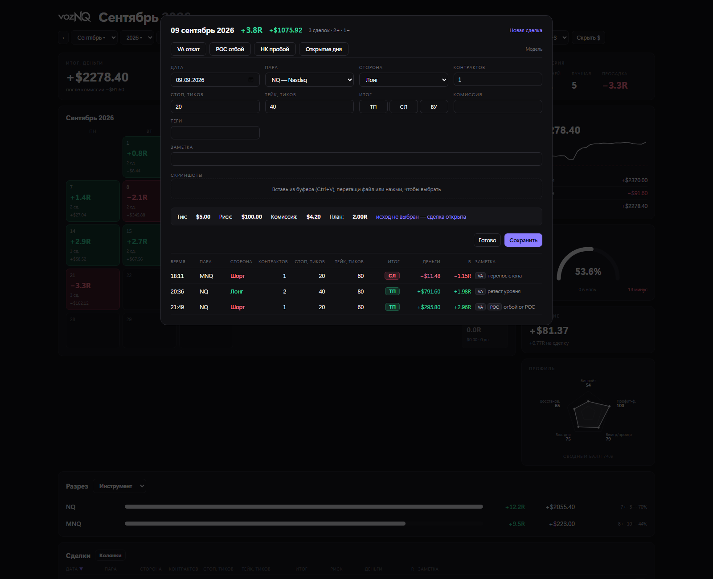
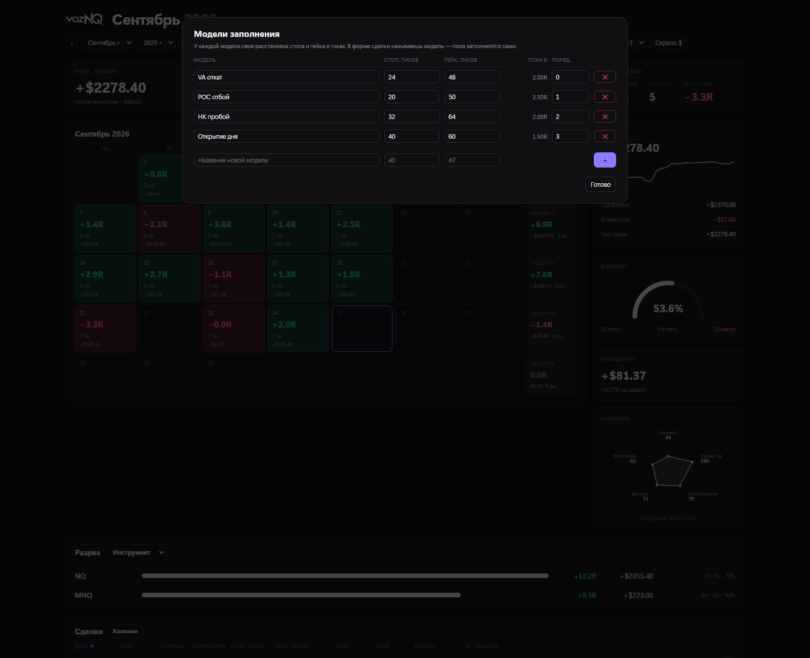
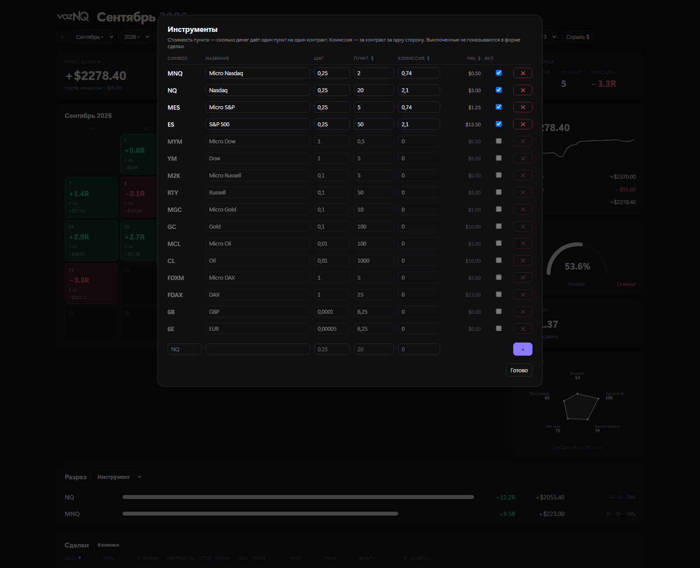
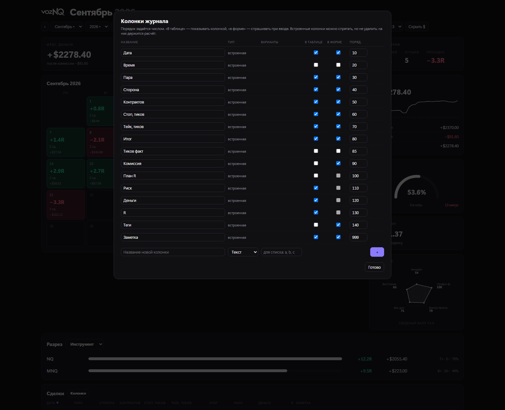

# Журнал трейдера

Настольный журнал сделок на фьючерсах. Один `.exe`, без установщика, без регистрации и без
облака: файл журнала лежит рядом с программой, наружу ничего не уходит.

> [English version](trade-journal.md) · [← к портфолио](../README.ru.md)
>
> **Все числа на снимках — сгенерированные демо-данные**, а не настоящие сделки: настоящий
> журнал ведёт живой счёт.

[▶ ролик на 30 секунд](../media/video/trade-journal.mp4)

---

## Задача

Отчёт брокера считает деньги. Трейдеру надо считать **риск**: те же +$200 — хороший день на
одном контракте и плохой на четырёх. Поэтому сделка вносится расстоянием в **тиках** — стоп
24, тейк 48, — а деньги, R (сколько рисков заработано) и статистику журнал считает сам.
Сменился инструмент или размер позиции — история не начинает врать.

---

## Экран месяца

**Верхняя строка — вся панель управления.**

| Кнопка | Что делает | Зачем удобно |
|---|---|---|
| `‹` `Сентябрь` `2026` `›` | листает месяцы | стрелками — по шагу, списками — сразу в месяц год назад |
| **Весь период** | переключает календарь на таблицу по месяцам за всю историю | один клик между «как идёт месяц» и «как идёт год» |
| **Риск по умолчанию $** | сколько денег стоит 1R | поменял один раз — и весь журнал пересчитан; после увеличения объёма сделки не переносятся заново |
| **+ Сделка** | открывает форму | |
| **Модели** | заготовки входа: стоп и тейк заранее | |
| **Инструменты** | цена тика, пункта, комиссия за контракт | |
| язык | русский / английский, переключается на лету | |
| часовой пояс | к какому дню отнести вечернюю сделку | сделка американской сессии в 01:30 по местному — это всё ещё предыдущий торговый день |
| **Скрыть $** | прячет деньги, оставляет R | чтобы показать экран, не показывая размер счёта |

**Пять карточек** — то немногое, что нужно с первого взгляда: итог в деньгах после комиссии,
итог в R, профит-фактор с средним плюсом и средним минусом под ним, доля зелёных дней и
серия — текущая, лучшая и самая глубокая просадка.

**Календарь** кладёт в каждую ячейку R дня, число сделок и деньги, красит зелёным или
красным и закрывает строку недельным итогом. Закономерности видно без разбора: вечно красные
понедельники или плохая неделя, которую хороший месяц прячет.

**Правая колонка**: кривая счёта с отмеченным началом, грязными → комиссия → чистыми
(комиссия — то, что тихо съедает скальпера), дуга винрейта с плюсами / нулями / минусами,
ожидание на сделку в деньгах и в R, и радар профиля — винрейт, профит-фактор, размер
выигрыша к проигрышу, зелёные дни, восстановление — со сводным баллом под ним.

**Разрез** внизу раскладывает результат по инструменту, по модели или по тегу.

Каждая ячейка дня — ссылка (`#day=2026-09-09`), день можно положить в закладки или отправить.

---

## Весь период

Та же статистика по всей истории плюс таблица по месяцам: R, деньги, сколько сделок и сколько
дней торговалось. Таблица сделок внизу берёт весь период — с отметкой исхода (ТП / СЛ / БУ),
риском, деньгами, R и заметкой, оставленной тогда же.

---

## День

Всё по одному дню в одном окне: уже внесённые сделки и форма для следующей.

- **Кнопки моделей** сверху заполняют стоп, тейк, инструмент и объём одним нажатием.
- **Итог** — ТП / СЛ / БУ или число тиков руками, если выход был не по плану.
- **Строка расчёта** пересчитывается на ходу: цена тика, риск в деньгах, комиссия и плановый
  R сделки. Видно, чем рискуешь, *до* сохранения.
- **Ctrl+Enter** сохраняет, не касаясь мыши.
- К сделке можно приложить скриншоты графика.

---

## Модели входа

Повторяющаяся расстановка получает имя, стоп и тейк в тиках, инструмент и объём по
умолчанию. Рядом показан плановый R — и модель с планом 1.5R заметно хуже модели на 2.5R ещё
до первой сделки по ней. В форме это одна кнопка вместо четырёх полей.

---

## Инструменты

Шестнадцать фьючерсов уже в списке — Nasdaq, S&P, Dow, Russell, золото, нефть, DAX, валюты, —
у каждого шаг, цена пункта и цена тика в долларах. **Комиссию за контракт за одну сторону**
вписываешь свою, ненужное выключаешь, чтобы не мешало в форме, недостающее добавляешь.

Без комиссии журнал льстил бы: на демо-данных она −$1060 за год, треть месячной прибыли.

---

## Колонки

Журнал не привязан к одному стилю торговли. Любую встроенную колонку можно спрятать — из
таблицы, из формы или отовсюду — и переставить числом порядка. И можно завести свою: текст,
число или список вариантов (настроение, сессия, новости, ссылка на скриншот).

Встроенные колонки прячутся, но не удаляются: на них держится расчёт.

---

## Как устроено

| | |
|---|---|
| Язык | Python, **только стандартная библиотека** — ни одного пакета из pip |
| Хранение | SQLite, один файл рядом с `.exe` |
| Окно | WebView2 (движок Edge, уже есть в Windows), одностраничный интерфейс |
| Поставка | один самодостаточный `.exe`, без установщика и прав администратора |
| Сервер | локальный HTTP на `127.0.0.1`, умеет работать и без окна (`--no-window`) |
| Данные | не покидают машину; резервная копия — копирование одного файла |

Интерфейс — одна страница с адресами через решётку (`#new`, `#day=…`, `#models`), поэтому на
любой экран можно дать ссылку: снимки выше сняты именно по этим ссылкам.
